# DVAPI Solution

Welcome to the Damn Vulnerable API (DVAPI) Tutorial! This tutorial provides step-by-step instructions for completing various challenges in DVAPI. Each challenge focuses on a different vulnerability or security issue commonly found in web applications. This tutorial aims to enhance your understanding of these vulnerabilities and guide you through the process of exploiting them.

# Lab Setup

Before we begin, let's set up the lab environment to ensure you have everything you need to follow along with the tutorial. You will need the following tools installed on your system:

* [git](https://git-scm.com/book/en/v2/Getting-Started-Installing-Git)
* [docker](https://docs.docker.com/get-docker/)

After making sure all of these are set up in your system, we can proceed to the instructions below:


1. **Clone the repository:**

```bash
git clone https://github.com/payatu/DVAPI.git
```


2. Navigate to the DVAPI directory:.

```bash
cd DVAPI
```


3. Use `docker compose` to build and run the application:

```bash
docker compose up --build
```


4. Access the DVAPI application at <http://127.0.0.1:3000>\n\n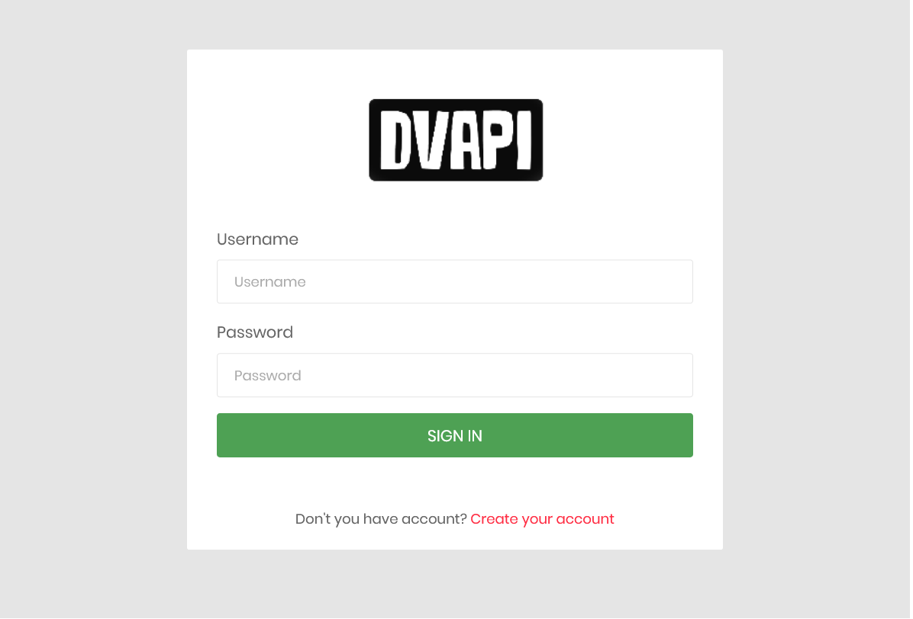

Once you have completed the lab setup, you're ready to dive into the challenges. Each challenge focuses on a specific vulnerability, and the following sections will guide you through its exploitation and solution.

# Challenges

### ==0xa1: Broken Object Level Authorization==

#### Challenge Overview:

* Drop off during a CTF challenge? No problem. Store a secret note on your profile to track your progress and resume where you left off.

#### Vulnerability Description:

* The vulnerability exploited in the "0xa1: Broken Object Level Authorization" challenge is related to inadequate object-level authorization in web application APIs. Object-level authorization refers to the process of controlling access to individual objects or resources within an application, such as files, database records, or functionalities.
* Insecure or broken object-level authorization occurs when an application fails to properly enforce access controls, allowing unauthorized users to access or manipulate sensitive objects. This vulnerability can arise due to various reasons, such as:

  
  1. Insufficient validation of user permissions: The application may not adequately check whether a user has the necessary privileges to perform specific actions on an object.
  2. Direct object reference: The application exposes direct references to objects or resources, making it easier for attackers to manipulate the references and access unauthorized objects.
  3. Incomplete or incorrect authorization checks: The application may lack proper authorization checks, or the implemented checks may contain flaws, allowing bypassing of access controls.
* By exploiting the broken object-level authorization vulnerability, an attacker can gain unauthorized access to restricted data, modify records, or perform actions reserved for privileged users. This can lead to unauthorized information disclosure, unauthorized modifications, and potentially compromise the entire application's security.

#### Exploitation Steps:


1. Login into the web application and get your auth token.\n\n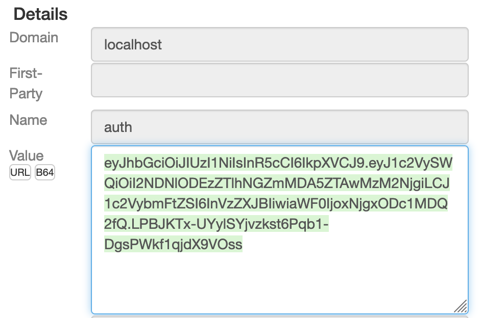\n
2. In Postman, go to `/api/getNote` and under authorization section, paste the auth value for type `Bearer Token` and send a request to the following end-point.

```
http://localhost:3000/api/getNote?username=<your-username>
```

 


3. We can see we have received notes for userA, now simply change the username to `admin`.\n\n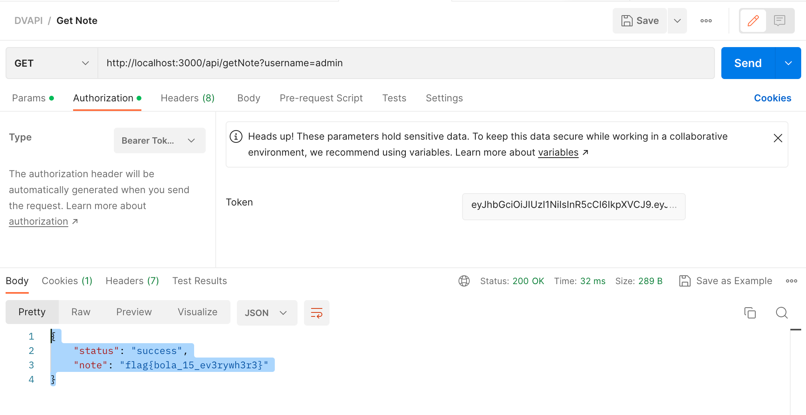

   \
4. The application returns the notes for user admin along with the flag.

#### Additional Resources:

* <https://owasp.org/API-Security/editions/2023/en/0xa1-broken-object-level-authorization/>

### ==0xa2: Broken Authentication==

#### Challenge Overview:

* Admin has a challenge for you. Admin says anyone who can log in with their account will get some surprise. Can you find out the surprise?

#### Vulnerability Description:

* The "0xa2: Broken Authentication" challenge focuses on the vulnerability related to inadequate or flawed authentication mechanisms in web application APIs. Authentication is the process of verifying the identity of users attempting to access a system or application.
* Broken authentication refers to vulnerabilities that can be exploited to bypass or compromise authentication mechanisms, allowing unauthorized individuals to gain unauthorized access to user accounts or administrative functionalities. This vulnerability can arise due to several reasons, including:

  
  1. Weak or guessable credentials: Users may employ weak passwords or utilize easily guessable information, making it easier for attackers to gain unauthorized access.
  2. Insecure session management: The application may have vulnerabilities in how it manages user sessions, such as failing to properly invalidate sessions or not using secure session tokens.
  3. Flawed authentication workflows: The application's authentication mechanisms may have implementation flaws or logic errors, enabling attackers to bypass authentication checks.
* By exploiting broken authentication, attackers can gain unauthorized access to user accounts, leading to various malicious activities, including unauthorized data access, privilege escalation, and potential account takeover. This can have severe consequences, such as unauthorized disclosure of sensitive information, identity theft, or disruption of services.

#### Exploitation Steps:


1. Login into the website and you'll receive your JWT Token in the authorization header. Save the JWT Token in a file.\n\n
2. Navigate to <https://jwt.io/> and paste the JWT token in the input field.  \n\n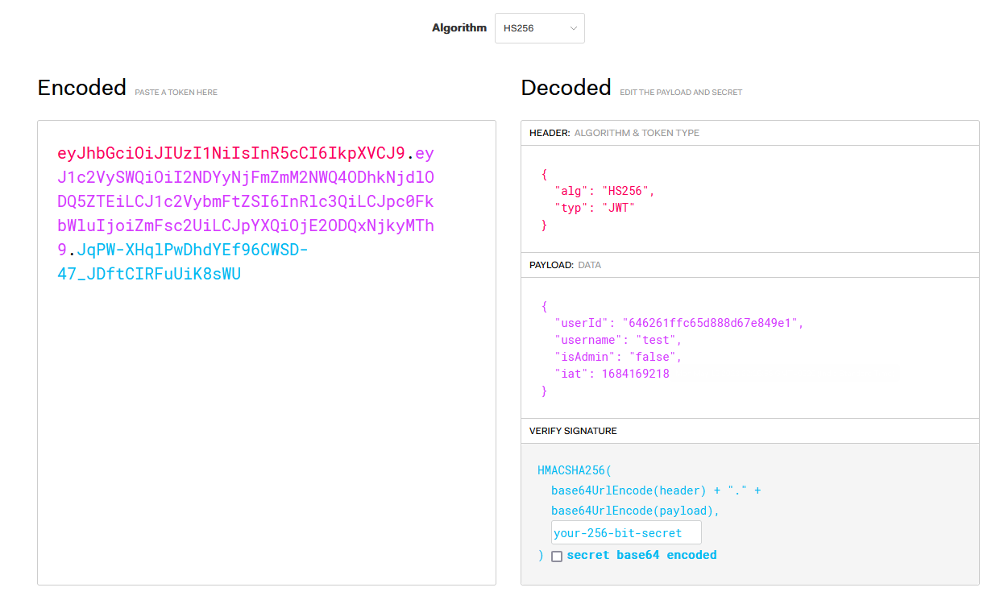


3. As you can see, the JWT Token is using the HS256 algorithm. This algorithm is a symmetric algorithm that requires a secret key to sign and verify the JWT. This secret key can be bruteforced using a proper wordlist. Also notice the parameter `isAdmin` set to `false` in the payload.

   \
4. We use `hashcat` and the wordlist `rockyou.txt` to crack the secret.

```bash
hashcat jwt.txt -m 16500 /usr/share/wordlists/rockyou.txt
```

 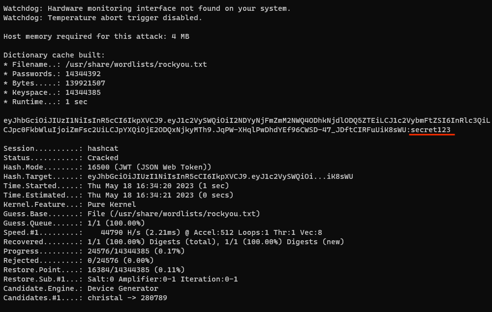\n


5. Using the obtained JWT secret, we will modify the JWT Token with `isAdmin` to `true`.\n\n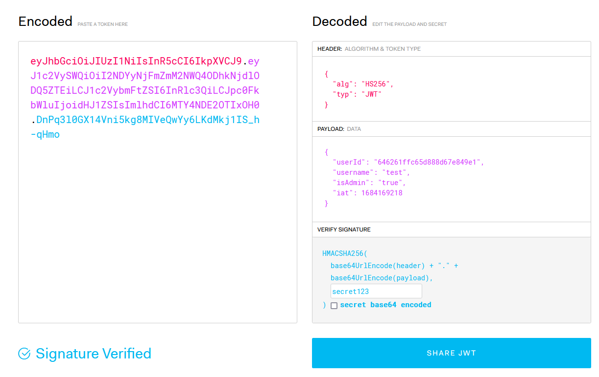\n
6. Use this JWT token to make a request to the DVAPI app. Let's use Postman to make the request. Set the Authorization type to `Bearer Token` and insert our new JWT token as shown below. Finally, send the request and the flag shall be visible in the response. \n 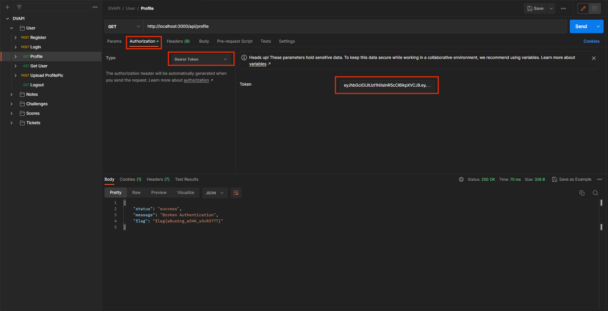


#### Additional Resources:

* <https://owasp.org/API-Security/editions/2023/en/0xa2-broken-authentication/>

### ==0xa3: Broken Object Property Level Authorization==

#### Challenge Overview:

* Ever wished there was a cheat code to top the scoreboard?

#### Vulnerability Description:

* The "0xa3: Broken Object Property Level Authorization" challenge revolves around the vulnerability related to inadequate authorization controls at the object property level within web application APIs. Object property level authorization refers to the fine-grained control of access to specific properties or attributes of an object.
* This vulnerability arises when the application fails to properly enforce authorization checks for individual properties or attributes of an object. This can occur due to various reasons, including:

  
  1. Insufficient validation of property-level permissions: The application may not adequately verify whether a user has the necessary privileges to access or modify specific properties of an object.
  2. Direct property reference: The application exposes direct references to object properties, making it easier for attackers to manipulate the references and access unauthorized properties.
  3. Incomplete or incorrect authorization checks at the property level: The application may lack proper authorization checks for specific properties or have flawed logic, allowing unauthorized access or modification.
* By exploiting the broken object property level authorization vulnerability, an attacker can gain unauthorized access to or manipulate specific properties of an object, even if they do not have the overall authorization to access the entire object. This can lead to unauthorized disclosure or modification of sensitive data, bypassing intended restrictions or business rules.

#### Exploitation Steps:


1. Open Postman and send a GET request to `/api/register` endpoint, along with username & password, and also specify the score property with a value that is over the maximum possible score of 1000 (10x100).\n\n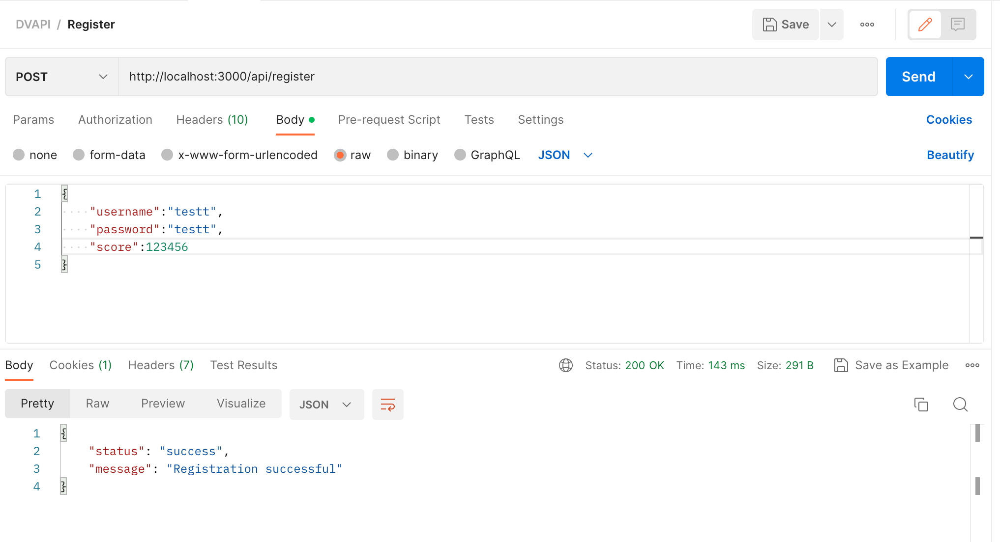\n\n
2. Now login into this user account make a GET request to `/api/scores` in postman using the token. You'll see that the score that we set in the account registration is saved for this user. Scroll below and you shall see the flag.


#### Additional Resources:

* <https://owasp.org/API-Security/editions/2023/en/0xa3-broken-object-property-level-authorization/>

### ==0xa4: Unrestricted Resource Consumption==

#### Challenge Overview:

* Do you know that you can customize your profile? Try it out and make your profile stand out among others.

#### Vulnerability Description:

* The "0xa4: Unrestricted Resource Consumption" challenge highlights the vulnerability related to unrestricted resource consumption in web application APIs. Unrestricted resource consumption, also known as resource exhaustion or denial-of-service (DoS), occurs when an application does not enforce limitations on the usage of critical resources.
* Critical resources refer to system resources such as CPU, memory, disk space, network bandwidth, or other resources utilized by the application. The vulnerability arises when the application fails to implement proper controls or limits on the consumption of these resources. This can be caused by various factors, including:

  
  1. Lack of validation on input size: The application may accept input without proper validation on the size of the input, leading to resource-intensive operations triggered by excessive input.
  2. Inefficient algorithms or data structures: The application may use inefficient algorithms or data structures that result in resource-intensive operations, such as high CPU or memory usage.
  3. Unbounded loops or recursive functions: The application may contain loops or recursive functions that do not have proper exit conditions or limitations, causing resource exhaustion when executed with certain inputs.
* By exploiting the unrestricted resource consumption vulnerability, an attacker can overwhelm the application's resources, leading to degraded performance or complete unavailability. This can result in denial-of-service conditions, impacting the availability and functionality of the application for legitimate users.

#### Exploitation Steps:


1. Login into the web application.
2. The DVAPI application users can upload their profile pictures by going to their profile page.
3. There is no file size limit validation on the upload endpoint and therefore users can upload files of any size.
4. In the profile picture upload API endpoint, select a file of large size, let's say 200MB, upload it and send it to `/profile/upload` through Postman.\n\n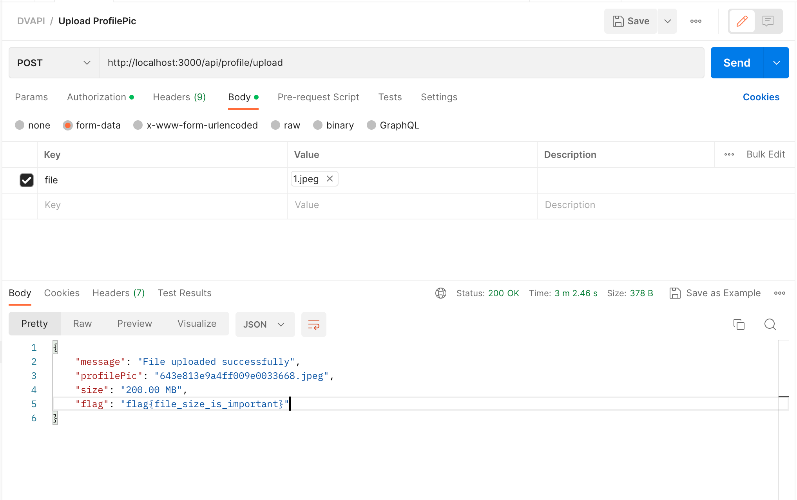\n
5. The flag will be visible in the response.

#### Additional Resources:

* <https://owasp.org/API-Security/editions/2023/en/0xa4-unrestricted-resource-consumption/>

### ==0xa5: Broken Function Level Authorization==

#### Challenge Overview:

* DVAPI has many users. You can see other's profile and others can see yours. What could go wrong here? Right? Right???

#### Vulnerability Description:

* The "0xa5: Broken Function Level Authorization" challenge highlights the vulnerability related to inadequate authorization controls at the function level within web application APIs. Function level authorization refers to the enforcement of access controls based on specific functionalities or actions performed by the application.
* This vulnerability occurs when the application fails to properly validate and enforce authorization checks for individual functions or actions. This can be caused by various factors, including:

  
  1. Insufficient validation of function-level permissions: The application may not adequately verify whether a user has the necessary privileges to perform specific functions or actions.
  2. Incorrect or incomplete authorization checks: The application may lack proper authorization checks or contain flawed logic when determining whether a user should be granted access to specific functions.
  3. Insecure or hardcoded authorization rules: The application may use hardcoded or static authorization rules that do not adapt to dynamic user roles or permissions. This can lead to either overprivileged access or insufficient restrictions on function-level actions.
* By exploiting the broken function level authorization vulnerability, an attacker can gain unauthorized access to functionalities or perform actions reserved for privileged users. This can lead to unauthorized manipulation of data, exposure of sensitive information, or disruption of critical system functions.

#### Exploitation Steps:


1. Login into the DVAPI application.
2. Make a GET request to a `/api/user/{username}` in Postman.\n\n

   \
3. We have a user named test. Now change the request method to `OPTIONS` to see what all HTTP methods are available.\n\n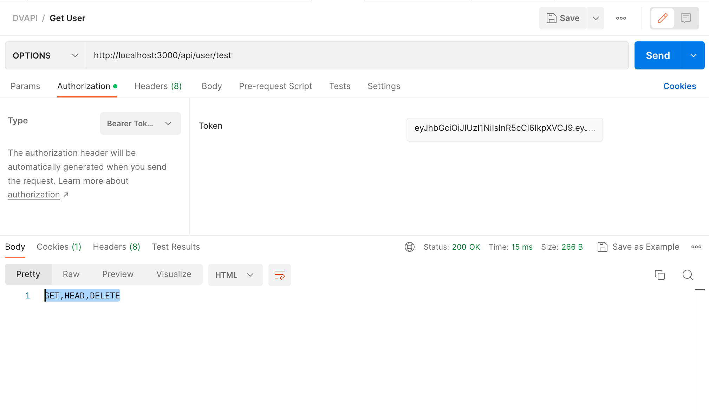


4. Notice that the `DELETE` method is available. Now change the request method to DELETE and this will delete user test.\n\n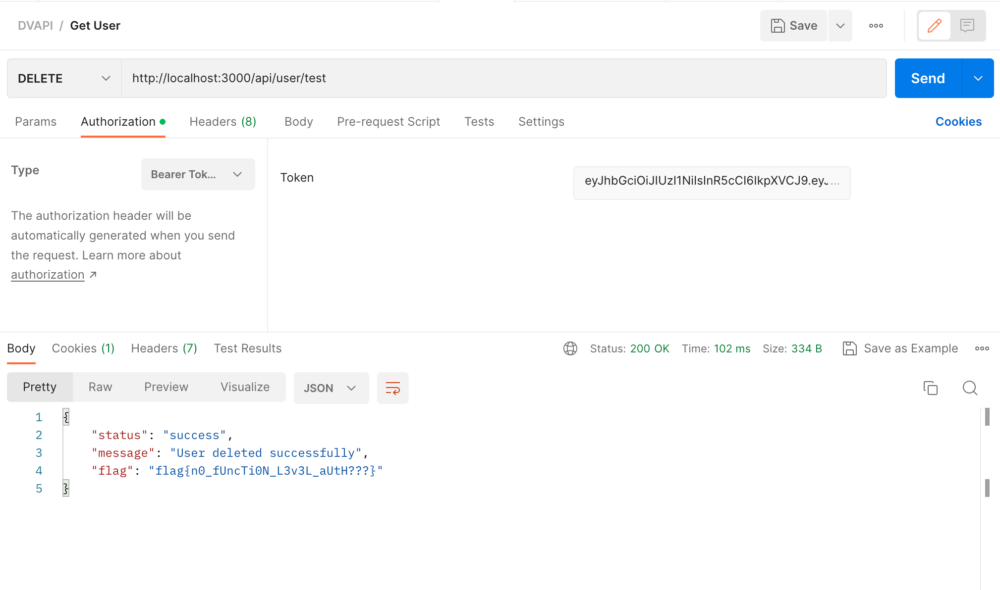


5. The response gives a success status and the user gets deleted. We also get the flag in the response.

#### Additional Resources:

* <https://owasp.org/API-Security/editions/2023/en/0xa5-broken-function-level-authorization/>

### ==0xa6: Server-Side Request Forgery==

#### Challenge Overview:

* DVAPI is using a function to set SecretNote for your user through a link/url. Try to learn more about SSRF and capture the flag !!!

#### Vulnerability Description:

* The "0xa6: Server-Side Request Forgery" challenge focuses on the vulnerability related to Server-Side Request Forgery (SSRF) in web application APIs. SSRF occurs when an attacker can manipulate or trick the server into making unauthorized requests on behalf of the application.
* This vulnerability arises from the application's failure to properly validate and sanitize user-supplied input that is used to make requests to external systems or resources. This can be caused by various factors, including:

  
  1. Insufficient input validation and sanitization: The application may accept user-provided input without appropriate validation or sanitization, allowing attackers to supply malicious or unexpected data.
  2. Lack of proper whitelisting or blacklisting: The application may not enforce strict controls on the allowed external resources or may rely on inadequate whitelisting or blacklisting mechanisms. This can enable attackers to bypass intended restrictions and interact with unauthorized resources.
  3. Insecure handling of redirects or forwards: The application may not properly validate or limit redirects or forwards, which can be exploited to redirect requests to unintended external systems.
* By exploiting the SSRF vulnerability, an attacker can bypass access controls and trick the server into performing unintended actions, potentially compromising the confidentiality, integrity, and availability of the application and associated resources.

#### Exploitation Steps:


1. Login into the application.
2. Make a request to `/api/addNoteWithLink` with the [interactsh](https://app.interactsh.com/) link(Burp Collaborator can also be used).\n\n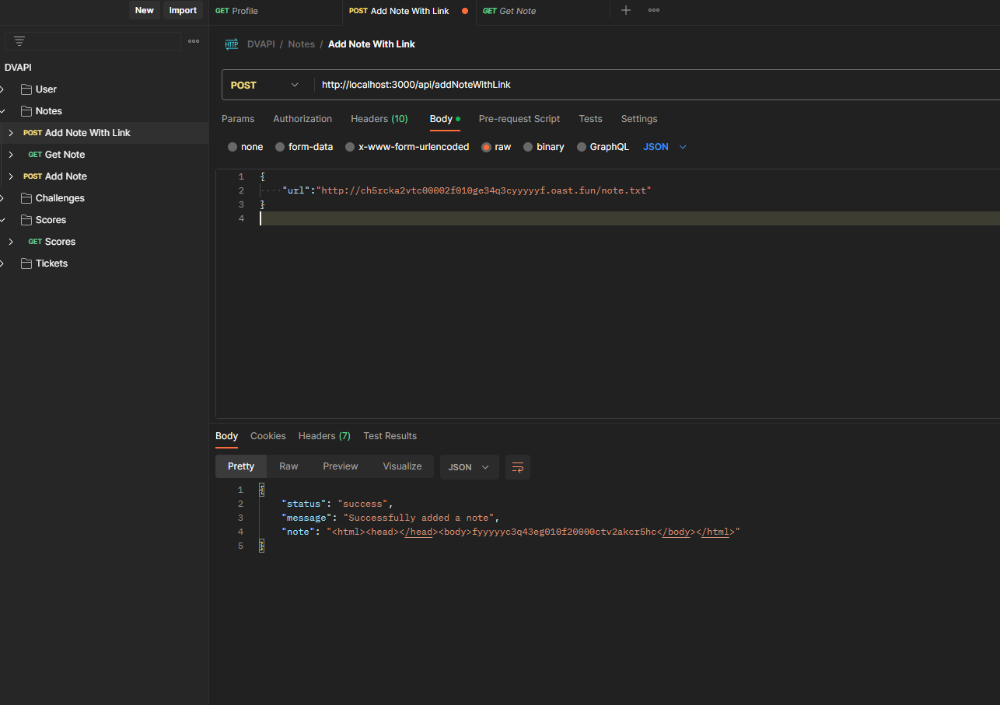


3. Check the interactsh portal\n\n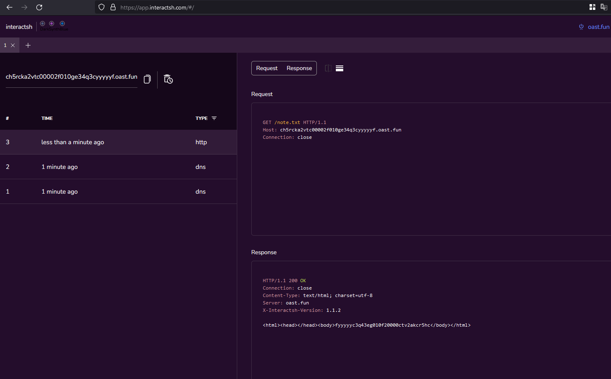


4. This confirms that the server is indeed making request to any URL that we specify. We can use this to do a port scan for internal services.
5. We can try doing a port scan via this SSRF. Trying common http port numbers, we stumble upon port 8443 where we get some response. It also contains the flag for this challenge.\n\n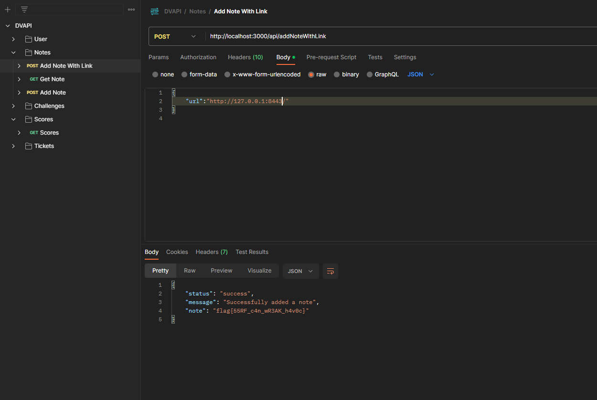


#### Additional Resources:

* <https://owasp.org/API-Security/editions/2023/en/0xa6-unrestricted-access-to-sensitive-business-flows/>

### ==0xa7: Security Misconfiguration==

#### Challenge Overview:

* The Developers at DVAPI are lazy which has led to a misconfigured system. Find the misconfiguration and submit the flag !!!

#### Vulnerability Description:

* The "0xa7: Security Misconfiguration" challenge focuses on the vulnerability related to security misconfigurations in web application APIs. Security misconfigurations occur when the application or its underlying infrastructure is not properly configured to adhere to recommended security practices.
* This vulnerability arises from the application's failure to implement secure configurations across various components, including the web server, application server, database, frameworks, or other third-party dependencies. Security misconfigurations can manifest in several ways, including:

  
  1. Default or weak configurations: The application may use default configurations that are known to be insecure or have weak settings, leaving it vulnerable to exploitation. Examples include using enabling unnecessary services or features, or using weak encryption or hashing algorithms.
  2. Improper access controls: The application may have misconfigured access controls that allow unauthorized access to sensitive resources or functionality. This can include improperly configured file or directory permissions, unrestricted access to administrative interfaces, or lack of proper role-based access controls.
  3. Inadequate error handling and logging: The application may have poor error handling and logging practices, which can leak sensitive information to attackers. This can include displaying detailed error messages to users or logging sensitive data in plaintext.
* By exploiting security misconfigurations, attackers can gain unauthorized access, escalate privileges, extract sensitive information, or launch other attacks that compromise the confidentiality, integrity, or availability of the application and its associated resources.

#### Exploitation Steps:


1. Login into the application.
2. Go to any `/api/` endpoint, for now let's make a request to `/api/user{username}` and replace the auth bearer token with any random string (that is, an invalid token).\n\n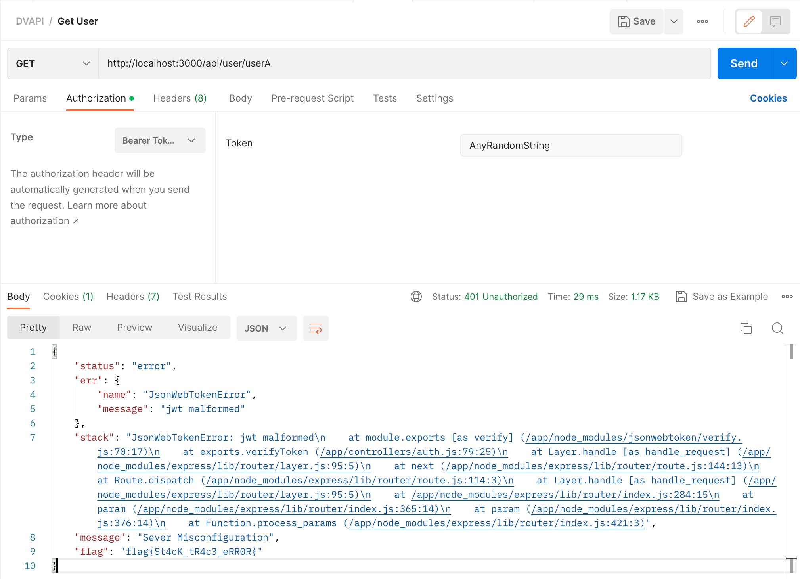


3. As you can see, the application does not have proper error handling due to which the stack trace error is displayed to the end user. We also get the flag for the challenge.

#### Additional Resources:

* <https://owasp.org/API-Security/editions/2023/en/0xa7-server-side-request-forgery/>

### ==0xa8: Lack of Protection from Automated Threats==

#### Challenge Overview:

* DVAPI is a people first applicaiton. We are keen on knowing your requests through submit ticket. Maybe it'll help you find the flag !!!

#### Vulnerability Description:

* The "0xa8: Lack of Protection from Automated Threats" challenge highlights the vulnerability related to the lack of adequate protection against automated threats in web application APIs. Automated threats, such as bots and scripts, are designed to exploit vulnerabilities or abuse functionality on a large scale without human intervention.
* This vulnerability occurs when the application does not have sufficient measures in place to detect and mitigate automated threats. This can be caused by various factors, including:

  
  1. Absence of CAPTCHA or similar challenges: The application may not implement CAPTCHA (Completely Automated Public Turing test to tell Computers and Humans Apart) or other challenges to differentiate between human and automated interactions. Without such mechanisms, attackers can automate malicious activities without hindrance.
  2. Inadequate rate limiting or throttling: The application may lack proper rate limiting or throttling mechanisms to restrict the frequency or volume of requests from a single source. This can enable attackers to launch automated attacks, such as brute force attacks or credential stuffing, without being detected or blocked.
* By exploiting the lack of protection from automated threats, attackers can carry out various malicious activities, including credential stuffing, account takeover, spamming, scraping sensitive data, or launching distributed denial-of-service (DDoS) attacks.

#### Exploitation Steps:


1. Login into the application and navigate to the Challenges page.
2. Create a ticket, capture the request in burp and send it to intruder.\n\n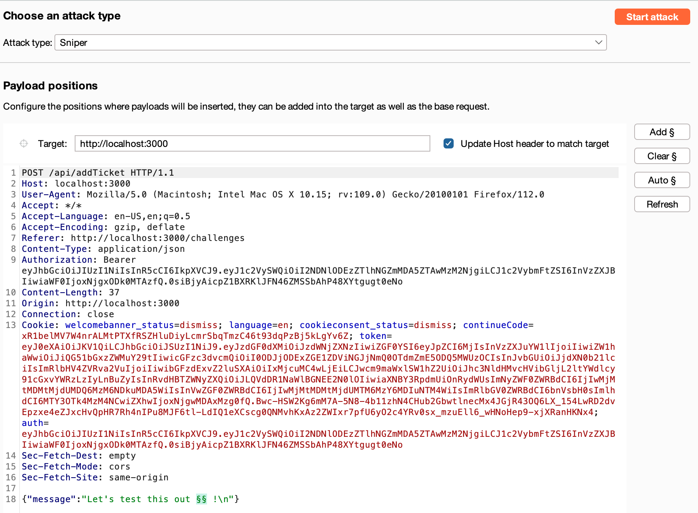


3. Go to the Payloads tab, choose Payload type as `Null payloads` and generate 100 requests.\n\n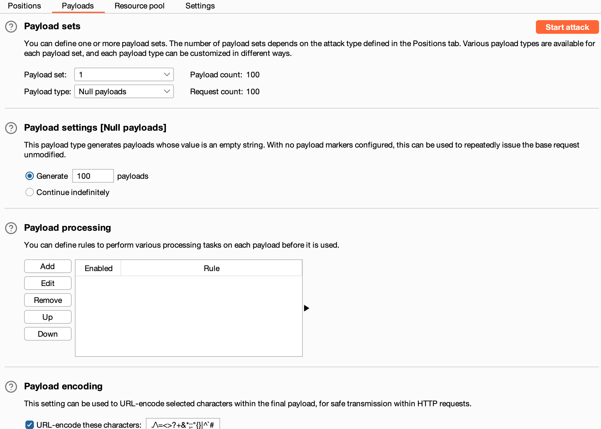


4. Finally run the attack and analyse the response lengths.\n\n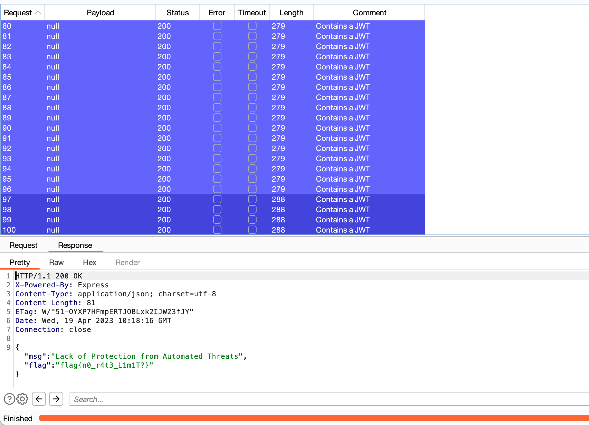


5. As you can see, there is no rate limit protection on this submit ticket endpoint. Someone with malicious intent can simply submit unlimited number of tickets to flood the admins with excessive tickets.
6. After around 96 tickets, we get the flag for the challenge in the response.

#### Additional Resources:

* <https://owasp.org/API-Security/editions/2023/en/0xa8-security-misconfiguration/>

### ==0xa9: Improper Assets Management==

#### Challenge Overview:

* There was a data leak at DVAPI. People found out there are 12 Challenges and not 10, What do you think ?

#### Vulnerability Description:

* The "0xa9: Improper Assets Management" challenge focuses on the vulnerability related to improper management of assets in the context of APIs. Improper assets management in APIs refers to inadequate handling and protection of API-related resources, such as endpoints, keys, tokens, or documentation.
* This vulnerability occurs when the API does not implement proper controls and safeguards for managing its assets. This can be caused by various factors, including:

  
  1. Insufficient access control mechanisms: The API may lack robust access control mechanisms to restrict unauthorized access to sensitive API endpoints or functionalities. This can allow attackers to access and manipulate data or perform unauthorized actions on the API.
  2. Insecure storage or transmission practices: The API may employ insecure storage or transmission practices for API keys, tokens, or other sensitive credentials. This can be due to storing credentials in plaintext, transmitting them over unencrypted channels, or using weak encryption algorithms. Attackers can exploit these weaknesses to obtain and abuse the credentials.
  3. Lack of proper documentation protection: The API documentation may be inadequately protected, allowing unauthorized individuals to access sensitive information, such as endpoint details, parameter descriptions, or authentication mechanisms. This can provide attackers with valuable insights into the API's functionality and security vulnerabilities.
* By exploiting improper assets management in APIs, attackers can gain unauthorized access, manipulate data, or abuse the API's functionalities, compromising the confidentiality, integrity, and availability of the API and its associated resources.

#### Exploitation Steps:


1. Login into the web application.
2. Navigate to the `/challenges` endpoint. An API request will be sent to `/api/allChallenges` with JSON body of `{"released": 1}`. This endpoint is used to obtain all the challenges\n\n\n
3. View the page's source and search for the "released" keyword. Observe that there is a commented part that uses the "unreleased" keyword.\n\n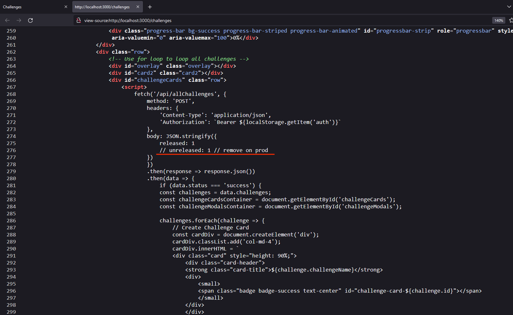\n
4. On Postman, log in and go to the `/api/allChallenges` endpoint at `Challenges > All Challenges`. Change the "released" keyword to "unreleased" and then send the request.\n\n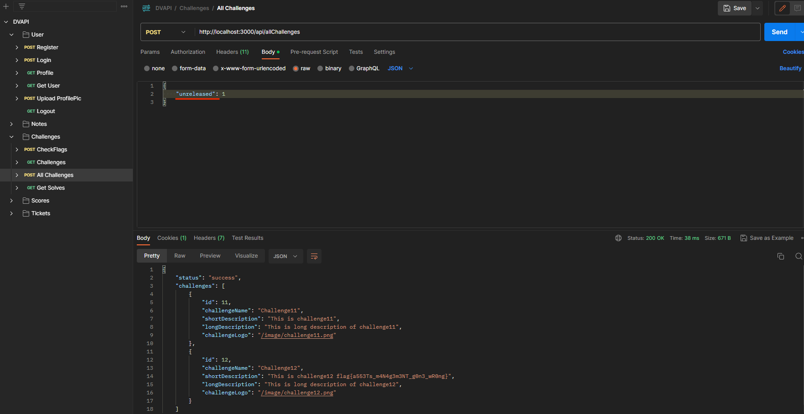\n
5. We obtain a list of unreleased challenges along with the flag for the challenge.

#### Additional Resources:

* <https://owasp.org/API-Security/editions/2023/en/0xa9-improper-inventory-management/>

### ==0xa10: Unsafe Consumption of APIs==

#### Challenge Overview:

* API's used at the Authentication of the application does not look safe, can you test it and get the flag ??

#### Vulnerability Description:

* The "0xaa: Unsafe Consumption of APIs" challenge focuses on the vulnerability related to the unsafe consumption of APIs in web application APIs. Unsafe consumption of APIs occurs when an application interacts with external APIs without implementing proper security measures and validation checks.
* This vulnerability arises from the application's failure to adequately handle and validate input and output data received from external APIs. This can be caused by various factors, including:

  
  1. Insufficient input validation: The application may not implement robust input validation mechanisms when processing data received from the API. This can be due to lax or incomplete validation routines, allowing malicious or unexpected input to be processed by the application.
  2. Poorly implemented input validation mechanisms: The application may have weak or ineffective input validation mechanisms when processing data received from the API. This can be due to coding errors, lack of input validation libraries, or failure to adhere to secure coding practices, leading to vulnerabilities such as injection attacks or data manipulation.
  3. Improper data validation and sanitization from other APIs: Failing to validate and sanitize data from other APIs prior to processing it or passing it to downstream components is a significant factor contributing to the vulnerability of unsafe API consumption.
* By exploiting the unsafe consumption of APIs, attackers can gain unauthorized access, manipulate data, or compromise the security of the application and its associated resources.

#### Exploitation Steps:


1. The authentication endpoints are one of the most attacked and exposed parts of an application.
2. In postman send a request to `/api/login` endpoint with the following value as password: `{"$ne": null}`.\n\n


2. The above payload will add the condition which will return true if the password does not match `null`. We use this payload to bypass the authentication to log in as `admin` user.
3. We get the flag when we log in as `admin`.

#### Additional Resources:

* <https://owasp.org/API-Security/editions/2023/en/0xaa-unsafe-consumption-of-apis/>